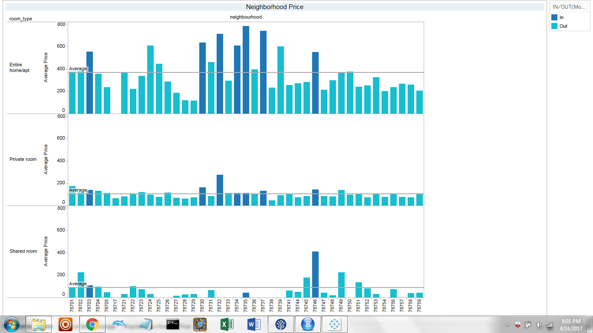
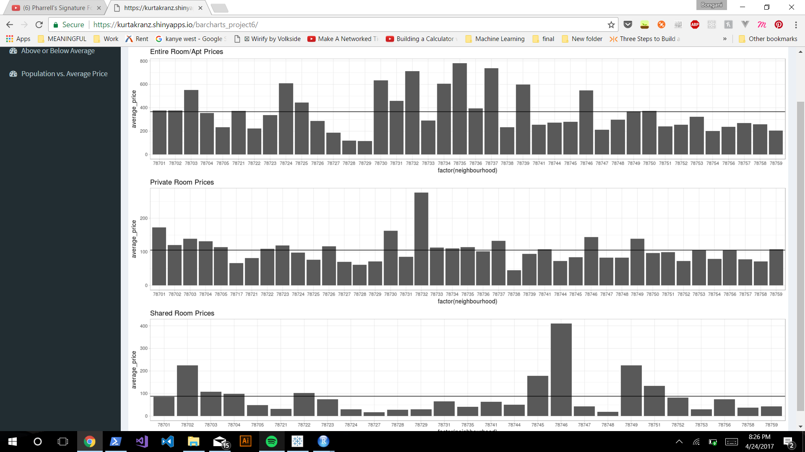
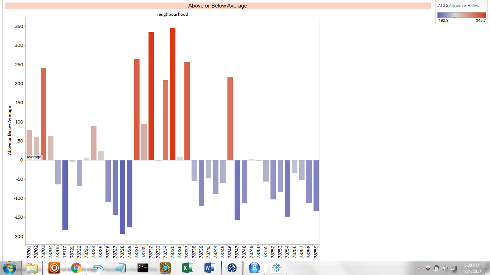
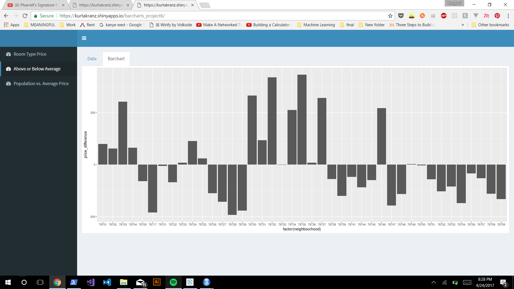
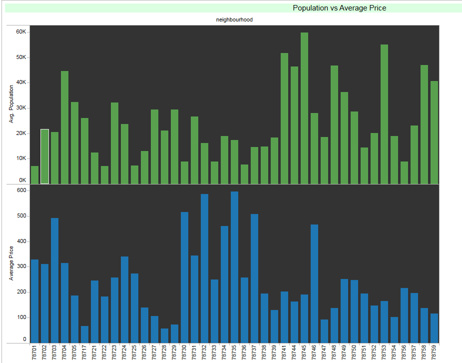
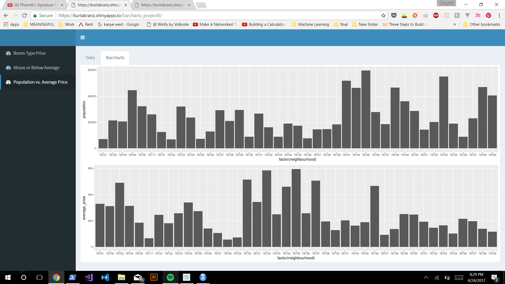

#**Introduction**
The Data Set explores [AirBnB Prices in Austin](https://data.world/kurtakranz/s-17-dv-project-6). 

#**The Data**

```{r sessionInfo}
sessionInfo(package=NULL)
```

```{r}
setwd(dir = "../00 Doc/")
source("../01 Data/ETL_listings.R")
summary(df)
```

```

##        id                                       name          host_id    
##  1001400:   1   East Austin Bungalow              :   6   4641823 : 127  
##  1002993:   1   East Austin Home                  :   4   31148752:  42  
##  1003316:   1   Euro Hostel/Dorm Style by Downtown:   4   8167447 :  26  
##  1003775:   1   Charming East Austin Bungalow     :   3   579290  :  18  
##  1009806:   1   East Austin Charmer               :   3   1488733 :  17  
##  1011620:   1   1 bedroom with private bath       :   2   1568741 :  15  
##  (Other):5829   (Other)                           :5813   (Other) :5590  
##    host_name    neighbourhood_group neighbourhood              latitude   
##  Erica  : 135   NA's:5835           78704  :1601   30.1305163587544:   1  
##  John   :  56                       78702  : 797   30.1399214304874:   1  
##  Sarah  :  51                       78703  : 419   30.1406878366631:   1  
##  Michael:  49                       78741  : 414   30.1415093891488:   1  
##  Ryan   :  45                       78745  : 328   30.1423321194423:   1  
##  (Other):5206                       78751  : 251   30.1424347881363:   1  
##  NA's   : 293                       (Other):2025   (Other)         :5829  
##              longitude              room_type        price     
##  -5.09368239448111:   1   Entire home/apt:4060   150    : 253  
##  -97.5670481812431:   1   Private room   :1652   200    : 227  
##  -97.586245659854 :   1   Shared room    : 123   250    : 203  
##  -97.5877635840428:   1                          300    : 181  
##  -97.6136226010006:   1                          100    : 175  
##  -97.6180279594552:   1                          125    : 156  
##  (Other)          :5829                          (Other):4640  
##  minimum_nights number_of_reviews     last_review   reviews_per_month
##  1      :2776   0      :2006      2015-10-26: 260   1      : 211     
##  2      :2005   1      : 698      2015-10-12: 215   0.13   : 194     
##  3      : 690   2      : 452      2015-10-25: 187   0.25   :  79     
##  4      : 147   3      : 302      2015-11-02: 177   2      :  77     
##  5      :  88   4      : 275      2015-10-27: 166   0.05   :  65     
##  7      :  43   5      : 186      (Other)   :2824   (Other):3201     
##  (Other):  86   (Other):1916      NA's      :2006   NA's   :2008     
##  calculated_host_listings_count availability_365
##  1      :4169                   365    :1236    
##  2      : 823                   364    : 268    
##  3      : 232                   363    : 203    
##  7      : 169                   0      :  92    
##  4      : 152                   362    :  80    
##  6      :  62                   361    :  71    
##  (Other): 228                   (Other):3885

```


Instruction to Reproduce
-------------------------
- Download the AirBnb data from data.world, search for "KurtAKranz" and download the dataset named "S17 DV Project 6."

- We ran a ETL script that standardized the data from "01 Data" folder. it standardized the colomn data to be consistent among all data points.

- from that, we used Tableau's Data connector to connect to our data set in data.world.

- We created 3 different visualizations using Reference lines, formatting, ID sets, and table calculations.

- Our first visualization we showed the average price of each room type, grouped by zipcode. For each room type, we had a reference line showing the average price of each room type.

- Our second visualization we showed each zip code's deviation from the average price of all zip codes.

- Our third visualization was Population Vs Average Price where we created a join between the census data and then created a bar chart with neighbourhood as the coloumns and AVG(Population) and AGG(Average Price) as the rows.

- For our shiny visualizations, we created data frames for each bar chart we had. We made specifc queries for whatever data we needed. Then we used ggplot to take our data frame and make it into a visualization.   


##[Shiny App](https://kurtakranz.shinyapps.io/barcharts_project6/) 


Neighborhood Prices
-----------------------------------------------------
- Our first visualization we showed the average price of each room type, grouped by zipcode For each room type, we had a reference line showing the average price of each room type. this adjust the average for the type of housing and accounts for that confounding feature.

###Tableau
<center></center>
###Shiny
<center></center>


Above or Below Average
-----------------------------------------------------
This shows the releative pricing for each location compared to the overall averaage. this enable comparision for pricing to be able to see if you are paying above the market average.


###Tableau
<center></center>
###Shiny
<center></center>


Neighborhood vs. Population
-----------------------------------------------------
- Our third visualization was Population Vs Average Price where we created a join between the census data and then created a bar chart with neighbourhood as the coloumns and AVG(Population) and AGG(Average Price) as the rows. This is interesting because it shows the simulariting between popuation size and pricing or rather the inverse reationship between the two.

###Tableau
<center></center>
###Shiny
<center></center>