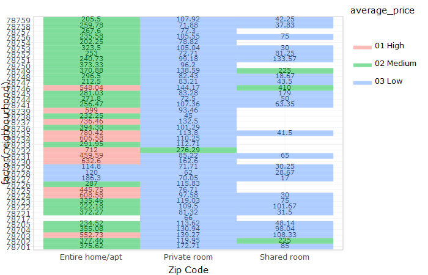
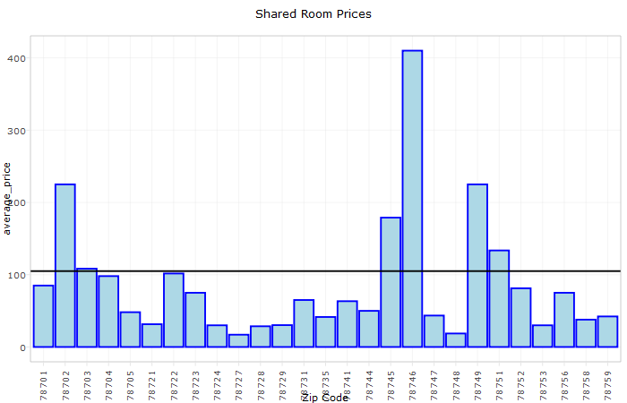
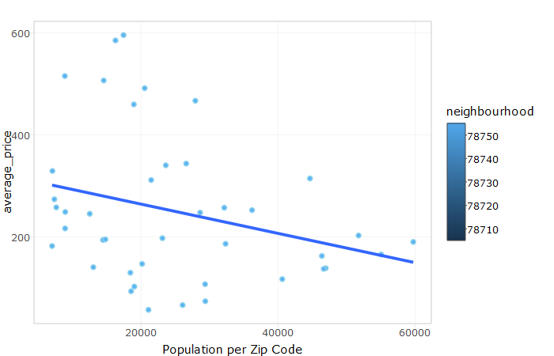

#**Introduction**
The Data Set explores [AirBnB Prices in Austin](https://data.world/kurtakranz/s-17-dv-final-project). 

#**The Data**

```{r sessionInfo}
sessionInfo(package=NULL)
```

```{r}
setwd(dir = "../00 Doc/")
source("../01 Data/ETL_listings.R")
summary(df)
```

```

##        id                                       name          host_id    
##  1001400:   1   East Austin Bungalow              :   6   4641823 : 127  
##  1002993:   1   East Austin Home                  :   4   31148752:  42  
##  1003316:   1   Euro Hostel/Dorm Style by Downtown:   4   8167447 :  26  
##  1003775:   1   Charming East Austin Bungalow     :   3   579290  :  18  
##  1009806:   1   East Austin Charmer               :   3   1488733 :  17  
##  1011620:   1   1 bedroom with private bath       :   2   1568741 :  15  
##  (Other):5829   (Other)                           :5813   (Other) :5590  
##    host_name    neighbourhood_group neighbourhood              latitude   
##  Erica  : 135   NA's:5835           78704  :1601   30.1305163587544:   1  
##  John   :  56                       78702  : 797   30.1399214304874:   1  
##  Sarah  :  51                       78703  : 419   30.1406878366631:   1  
##  Michael:  49                       78741  : 414   30.1415093891488:   1  
##  Ryan   :  45                       78745  : 328   30.1423321194423:   1  
##  (Other):5206                       78751  : 251   30.1424347881363:   1  
##  NA's   : 293                       (Other):2025   (Other)         :5829  
##              longitude              room_type        price     
##  -5.09368239448111:   1   Entire home/apt:4060   150    : 253  
##  -97.5670481812431:   1   Private room   :1652   200    : 227  
##  -97.586245659854 :   1   Shared room    : 123   250    : 203  
##  -97.5877635840428:   1                          300    : 181  
##  -97.6136226010006:   1                          100    : 175  
##  -97.6180279594552:   1                          125    : 156  
##  (Other)          :5829                          (Other):4640  
##  minimum_nights number_of_reviews     last_review   reviews_per_month
##  1      :2776   0      :2006      2015-10-26: 260   1      : 211     
##  2      :2005   1      : 698      2015-10-12: 215   0.13   : 194     
##  3      : 690   2      : 452      2015-10-25: 187   0.25   :  79     
##  4      : 147   3      : 302      2015-11-02: 177   2      :  77     
##  5      :  88   4      : 275      2015-10-27: 166   0.05   :  65     
##  7      :  43   5      : 186      (Other)   :2824   (Other):3201     
##  (Other):  86   (Other):1916      NA's      :2006   NA's   :2008     
##  calculated_host_listings_count availability_365
##  1      :4169                   365    :1236    
##  2      : 823                   364    : 268    
##  3      : 232                   363    : 203    
##  7      : 169                   0      :  92    
##  4      : 152                   362    :  80    
##  6      :  62                   361    :  71    
##  (Other): 228                   (Other):3885

```


Instruction to Reproduce
-------------------------
- Download the AirBnb data from data.world, search for "KurtAKranz" and download the dataset named "S17 DV Final Project."

- We ran a ETL script that standardized the data from "01 Data" folder. It standardized the colomn data to be consistent among all data points.

- From that, we used Tableau's Data connector to connect to our data set in data.world.

- We created 6 different visualizations using Boxplots, Scatter Plots, Histrograms, Crosstabs, and Barcharts.

- Our first visualization, we showed a crosstab using zip code and room type, with a key performance idicator of average price. We also created parameters that effectively let one select a price range for acceptable locations.

- Our second visualization, we showed each zip code's deviation from the average price among all zip codes. From this, we created a set of the top 5 most pricey zip codes.

- Our third visualization, we showed the average price of each room type, grouped by zipcode. For each room type, we had a reference line showing the average price of each room type.

- Our fourth visualization, we created a histogram using the average price to convey that the data is skewed right. This means that using the mean to calculate the average is not going to be as accurate as using the median.

- Our fifth visualization was Population Vs Average Price where we created a join between the census data and then created a scatter plot with neighbourhood as the coloumns and AVG(Population) and AGG(Average Price) as the rows. We then added a trend line to convey the data's negetive trend.

- Our sixth and final visualization, we created a boxplot for the prices of the top 5 most pricey zip codes. This showed the outliars in the data, showing again that the median is the better way to express the average.

- For our shiny visualizations, we created data frames for each graph we had. We made specifc queries for whatever data we needed. Then we used ggplot to take our data frame and create a ggplot object. From that, we used plotly to express the ggplot data with a more interactive display.  


##[Shiny App](https://kurtakranz.shinyapps.io/airbnb_austin/) 


Crosstab with Average Price KPI
-----------------------------------------------------
- Crosstab using zip code and room type, with a key performance idicator of average price. Parameters were set at 197 for the low end, and 425 for the high end. Effectively making $197 - $425 someones price range. Values in that range are highlighted green. Values above are red, and values below are blue.

###Tableau
<center></center>
###Shiny
<center></center>


Above or Below Average
-----------------------------------------------------
This shows the releative pricing for each zip code compared to the overall average. This enables comparision for pricing to see if you are paying above the market average.


###Tableau
<center></center>
###Shiny
<center></center>


Room Type vs. Price
-----------------------------------------------------
- The average price of each room type, grouped by zipcode. For each room type, there is a reference line showing the average price of each room type. This 

###Tableau
<center></center>
###Shiny
<center></center>
<center></center>
<center></center>


Price Histogram
-----------------------------------------------------
Histogram using the average price to convey that the data is skewed right. This means that using the mean to calculate the average is not going to be as accurate as using the median.


###Tableau
<center></center>
###Shiny
<center></center>


Population vs. Average Price
-----------------------------------------------------
Scatter Plot created using a join between our data and the census data. The trend line's negative slope indicated that the average price of a zip code decreases as the population of the zip code increases.


###Tableau
<center></center>
###Shiny
<center></center>


Top 5 Most Pricey Zip Codes
-----------------------------------------------------
Boxplot for the prices of the top 5 most pricey zip codes. This showed the outliars in the data, showing again that the median is the better way to express the average.


###Tableau
<center></center>
###Shiny
<center></center>


Price Density Map
-----------------------------------------------------
A map of Austin zip codes and the average price associated with each area. The red areas are zip codes with prices above the city's average, the blue areas are zip codes with price being below the city's average.


###Tableau
<center></center>
